# 高通量脑机接口（High-Throughput Brain-Computer Interface，HT-BCI）数据集预处理清洗和可视化的尝试

2152505栾学禹 

## 写在最前面
王阳明说知行合一，这句话也是我写在期末试卷上的一句话，我相信在精美绚丽的理论，最终也要落到实践的土壤里去，才能真正开出花来，正因如此，我为我的期末文本作业选择了一个偏向于实践的方向，我希望通过这个作业，能够浅浅的看一眼脑科学数据分析的大门，利用python中的mne库，对eeglab中的标准数据进行初步的数据清洗和可视化，便是此片报告的目的所在。


## 摘要：

本文主要针对脑机接口（BCI）技术，进行了一些数据分析方面尝试和思考。首先，介绍了BCI技术的基本概念和主要特点，然后，针对BCI技术在实际应用进行实践。

## 简介：What is HI-BCI？
高通量脑机接口（High-Throughput Brain-Computer Interface，HT-BCI）是指一类BCI技术，其主要特征是能够处理和分析大量的神经信号数据，并能够在较短时间内实现高效的信息提取和处理。这种技术主要关注提高数据采集速度、增强信号处理能力以及优化用户交互体验。

### 主要特点和目标：
- 数据处理能力：

HT-BCI致力于处理和分析大规模的神经信号数据。这些数据可以是高频率的脑电图（EEG）信号、功能磁共振成像（fMRI）数据、脑磁图（MEG）数据等，需要能够在短时间内进行实时处理和分析。
- 高速数据采集：

这类BCI系统通常设计为能够以高速采集大脑信号，以捕捉到更多的时间相关信息和动态变化，从而提高系统的响应速度和准确性。
- 用户交互效率：

HT-BCI旨在优化用户与外部设备或系统之间的交互效率。通过快速准确地捕捉用户的意图或脑活动，实现更加自然和即时的控制反馈。
- 应用领域：

HT-BCI技术的应用范围广泛，涵盖了从医疗领域（如康复治疗、神经反馈治疗）到工业和娱乐应用（如智能控制系统、虚拟现实交互）等多个领域。
### 技术挑战和发展趋势：

- 信号处理和算法优化：面对大规模数据的处理挑战，HT-BCI需要先进的信号处理算法和模型优化，以提高数据的信息提取能力和准确性。

- 硬件和传感器技术：发展更高灵敏度和分辨率的传感器技术，以及适应快速数据传输和处理需求的硬件平台。

- 实时性和响应速度：优化系统架构和数据流程，以确保快速响应用户的意图和动态变化的脑活动。


## 实践过程

根据脑电的标准分析流程，可以分为以下八个步骤：
- **Step 1: 读取数据**  
- **Step 2: 滤波**  
- **Step 3: 去伪迹**  
- **Step 4: 重参考**  
- **Step 5: 分段**  
- **Step 6: 叠加平均**  
- **Step 7: 时频分析**
- **Step 8: 提取数据**

由于完整的实验流程过于庞大，这里只实现先三个步骤

## 步骤一：读取数据
```python
import numpy as np
import mne
from mne.preprocessing import ICA
from mne.time_frequency import tfr_morlet

data_path = "/Users/zitonglu/Desktop/EEG/eeglab14_1_2b/sample_data/eeglab_data.set"

raw = mne.io.read_raw_eeglab(data_path, preload=True)
```


MNE-Python中对多种格式的脑电数据都进行了支持：
- 如数据后缀为.set (来自EEGLAB的数据)  
使用mne.io.read_raw_eeglab()
- 如数据后缀为.vhdr (BrainVision系统)  
使用mne.io.read_raw_brainvision()
- 如数据后缀为.edf  
使用mne.io.read_raw_edf()
- 如数据后缀为.bdf (BioSemi放大器)   
使用mne.io.read_raw_bdf()
- 如数据后缀为.gdf  
使用mne.io.read_raw_gdf()
- 如数据后缀为.cnt (Neuroscan系统)  
使用mne.io.read_raw_cnt()
- 如数据后缀为.egi或.mff  
mne.io.read_raw_egi()
- 如数据后缀为.data  
使用mne.io.read_raw_nicolet()
- 如数据后缀为.nxe (Nexstim eXimia系统)  
使用mne.io.read_raw_eximia()
- 如数据后缀为.eeg (Nihon Kohden系统)  
使用mne.io.read_raw_nihon()

### 查看原始输入信息
```python
print(raw)
print(raw.info)
```
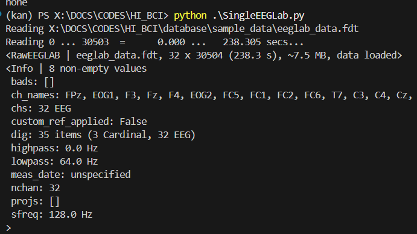
可以看到该脑电数据为32个导联，30504个时间点（采样率为128Hz，对应238.3s的长度）  

由于读取数据时preload设为True，数据读入内存中，数据大小约为7.5MB  

导联名其次为EEG 000, EEG 001, EEG 002, EEG 003等等  
未进行参考  

高通滤波0.0Hz，低通滤波64.0Hz  

### 电极定位
这里由于导联名称不是标准的名称  
如果碰到类似问题，需要手动导入脑电数据的电极位置信息  
在这个例子中，即需要把数据集相关的.locs文件中的信息传入这里读取的脑电数据中。
比如很多专门的软件，那么他们的导联名称是由指定的定位信息的，可以直接对应到头部的位置。

```python
 # locs文件地址
    locs_info_path = os.path.join(root,'database','sample_data','eeglab_chan32.locs')
    # 读取电极位置信息
    montage = mne.channels.read_custom_montage(locs_info_path)
    # 读取正确的导联名称
    new_chan_names = np.loadtxt(locs_info_path, dtype=str, usecols=3)
    # 读取旧的导联名称
    old_chan_names = raw.info["ch_names"]
    # 创建字典，匹配新旧导联名称
    chan_names_dict = {old_chan_names[i]:new_chan_names[i] for i in range(32)}
    # 更新数据中的导联名称
    raw.rename_channels(chan_names_dict)
    # 传入数据的电极位置信息
    raw.set_montage(montage)
    print("===============================================================================================")
    print("locs文件地址")
    print(locs_info_path)
    locs_info_path = os.path.join(root,'database','sample_data','eeglab_chan32.locs')
    print("===============================================================================================")
    print("读取电极位置信息")
    print(montage)
    montage = mne.channels.read_custom_montage(locs_info_path)
    print("===============================================================================================")
    print("读取正确的导联名称")
    print(new_chan_names)
    new_chan_names = np.loadtxt(locs_info_path, dtype=str, usecols=3)
    print("===============================================================================================")
    print("读取旧的导联名称")
    print(old_chan_names)
    old_chan_names = raw.info["ch_names"]
    print("===============================================================================================")
    print("创建字典，匹配新旧导联名称")
    print(chan_names_dict)
    chan_names_dict = {old_chan_names[i]:new_chan_names[i] for i in range(32)}
    print("===============================================================================================")
    print("更新数据中的导联名称")
    print(chan_names_dict)
    raw.rename_channels(chan_names_dict)
    print("===============================================================================================")
    print("传入数据的电极位置信息")
    print(montage)
    raw.set_montage(montage)
    print("===============================================================================================")

```
[](./references/8.png)
[](./references/9.png)

当你的脑电电极位点为一些特定系统时，可以直接用mne.channels.make_standard_montage函数生成
以标准的国际10-20系统为例，对应代码即可改为： 

```python
 montage = mne.channels.make_standard_montage("standard_1020")   
```

MNE中现成的其他定位系统的montage可以通过以下网址查询：  
[https://mne.tools/stable/generated/mne.channels.make_standard_montage.html#mne.channels.make_standard_montage](https://mne.tools/stable/generated/mne.channels.make_standard_montage.html#mne.channels.make_standard_montage)


### 导联类型修正
由于mne默认导入的导联类型就是EEG信号，因此需要手动修改为EOG信号。

```python

chan_types_dict = {"EOG1":"eog", "EOG2":"eog"}
raw.set_channel_types(chan_types_dict)
print(raw.info)
```

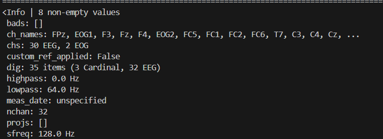

### 绘制原始波形图
当读取到数据之后就自带方法plot进行作图
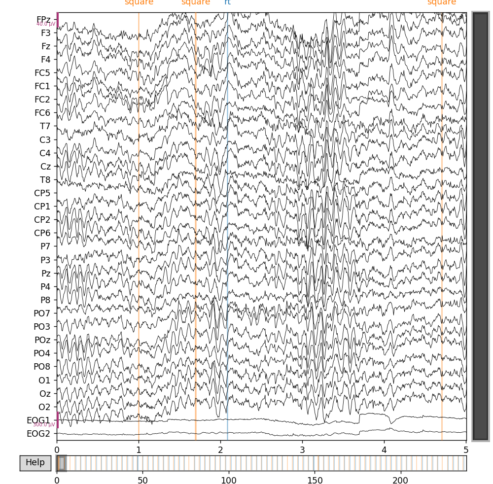

### 绘制原始功率图谱
```python
raw.plot_psd(average=True)
```
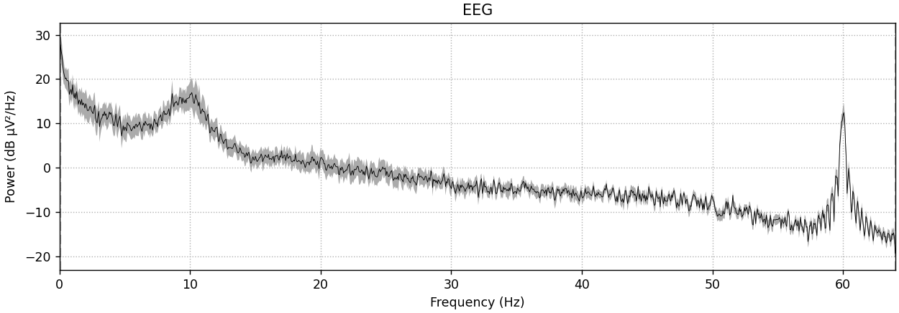

### 绘制电极图谱
```python
raw.plot_sensor(ch_type='eeg',show_names=True)
```
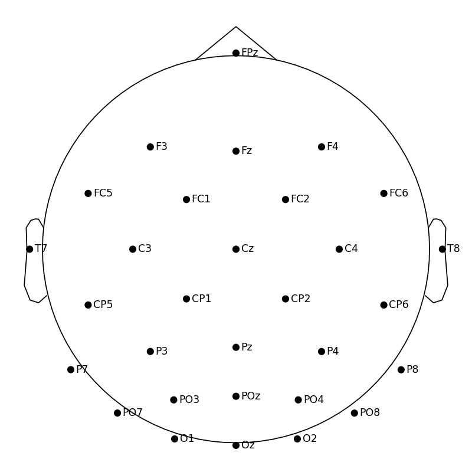


## 步骤二：滤波


通过前面的功率图谱我们可以大致推测出来60hz的地方可能存在环境噪声，因此可以使用陷波滤波器进行数据初步清洗，去掉工频。

由此也可以看得出来，这个数据集不是中国内地的数据集，因为一般内地的数据集工频频率为50hz，而这里工频频率为60hz。
但是也不能够一概而论，还是应该根据功率图谱进行判断。

```python
raw.filter(l_freq=1,h_freq=60)
plt.show(block=True)  # 阻塞程序直到图形被关闭
```

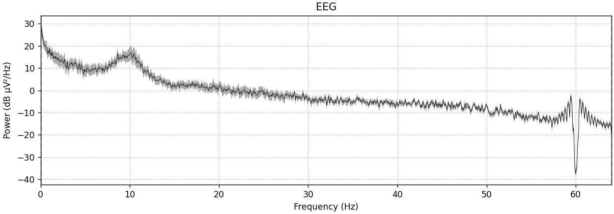


### 高低通滤波
预处理步骤中，通常需要对数据进行高通滤波操作  
此处采用最常规的滤波操作，进行30Hz的低通滤波及0.1Hz的高通滤波  
高通滤波为了消除电压漂移，低通滤波为了消除高频噪音
```python 
raw=raw.flite(l_freq=0.,h_freq=30)
#绘制功率图谱
raw.plot_psd(average=True)
plt.show(block=True)  # 阻塞程序直到图形被关闭
```

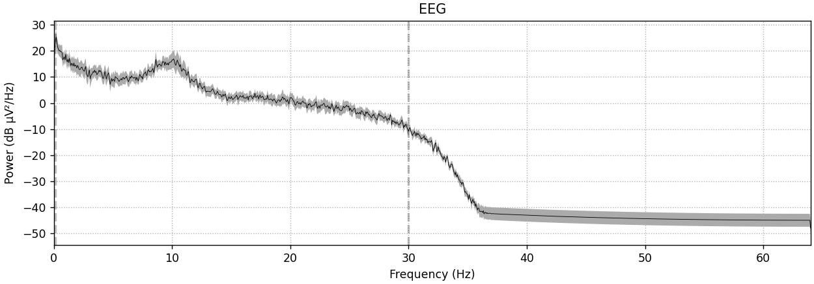


## 步骤三：ICA独立成分分析

MNE中进行ICA的编程思路是首先构建一个ICA对象（可以理解成造一个ICA分析器）  
然后用这个ICA分析器对脑电数据进行分析（通过ICA对象的一系列方法）  
由于ICA对低频分离效果不好  
这里对高通1Hz的数据进行ICA及相关成分剔除，再应用到高通0.1Hz的数据上

```python
ica = ICA(max_iter='auto')
raw_for_ica = raw.copy().filter(l_freq=1, h_freq=None)
ica.fit(raw_for_ica)
```

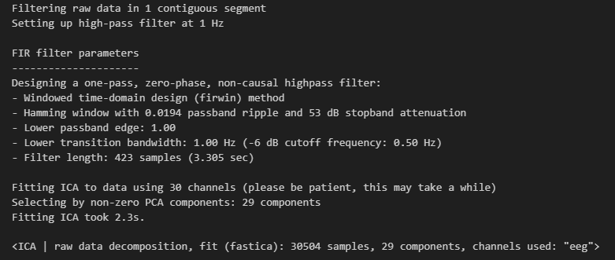

这里没有设定n_components，即ICA的成分数让MNE的ICA分析器自动去选择  
类似EEGLAB，如果希望ICA的成分数为固定个数，可以自定义设置（n_components<=n_channels）  
以30个独立成分为例，对应代码改为如下即可：  
```python
 ica = ICA(n_components=30, max_iter='auto')
```

### 绘制各成分的时序信号图

```python
ica.plot(raw_for_ica)
```
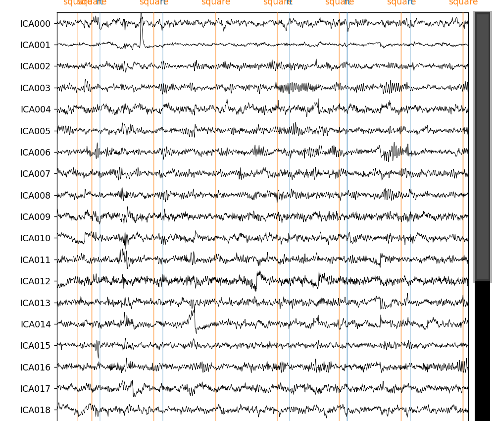

### 绘制各成分的地形图

```python
ica.plot_components() 
```
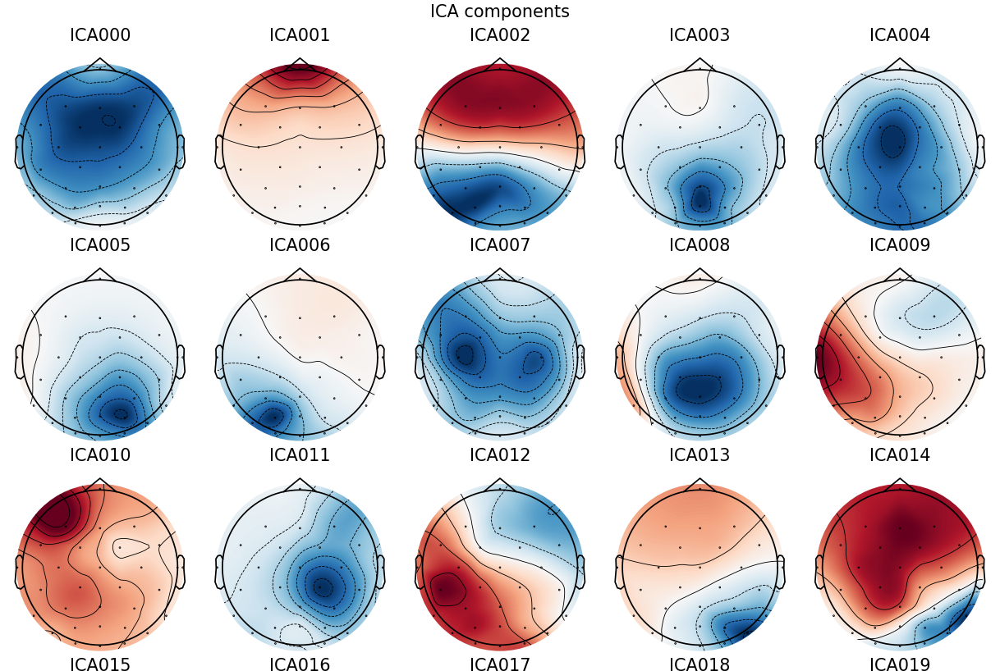

#### 查看去掉某一成分前后信号差异

这里以去掉第2个成分（即ICA001）为例

```python
ica.plot_overlay(raw_for_ica, exclude=[1])
```
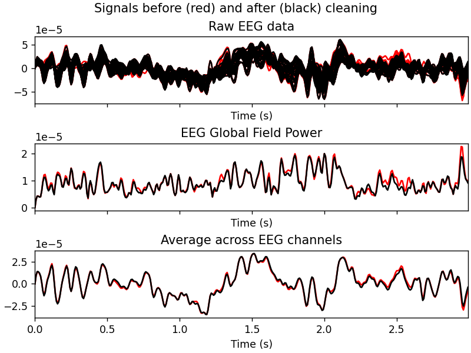


### 绘制各成分的功率图谱

```python
ica.plot_properties(raw_for_ica, picks=[0,1,2], psd_args={'n_fft': 256, 'n_overlap': 128})
```
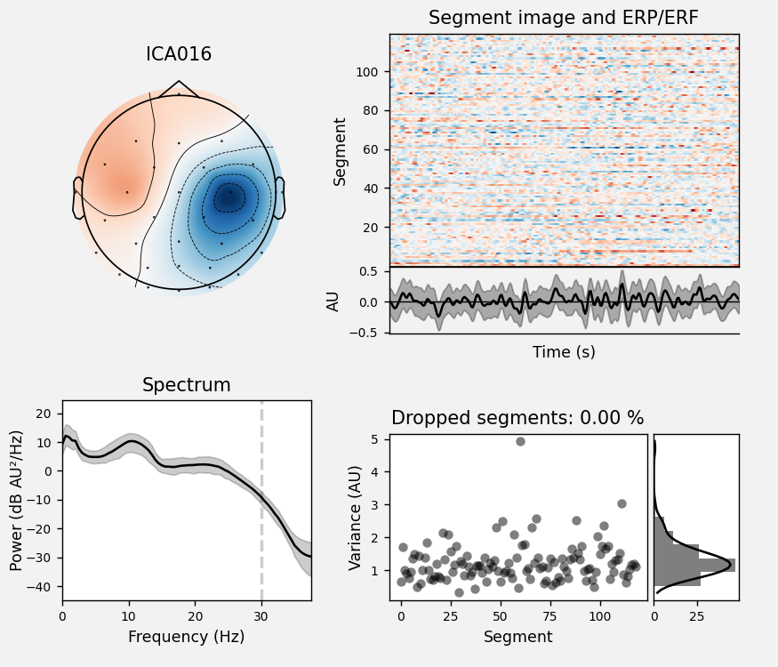


### 单个可视化每个成分

这里可视化第2个成分（ICA001）和第17个成分（ICA016）

```python
ica.plot_properties(raw, picks=[1, 16])
```

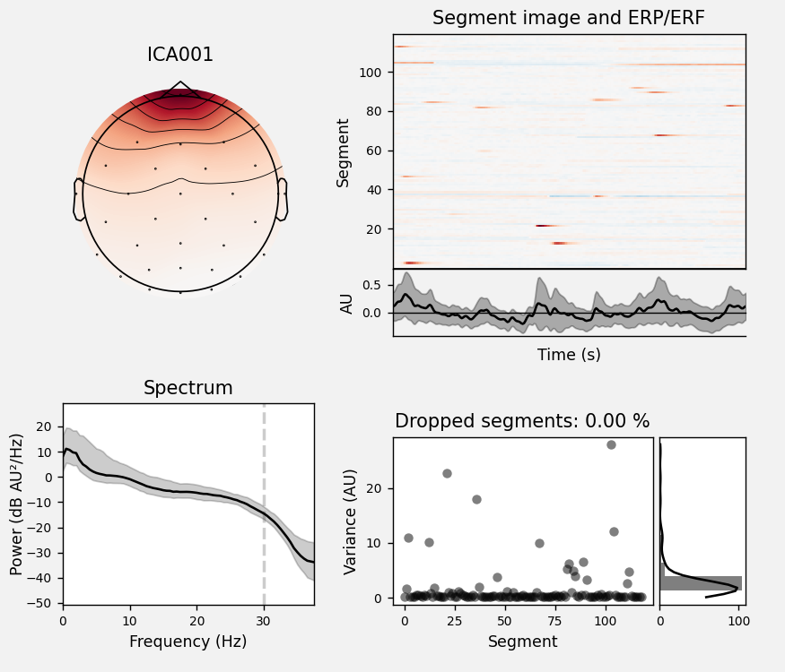

成分ICA001的能量较高处为前额，且在低频处能量较高，在一些trials中有明显增强  
可以判断为一个眼动成分  
成分ICA016不太像异常成分

### 剔除成分,绘制ICA后的数据波形图
```python
# 设定要剔除的成分序号
ica.exclude = [1]
# 应用到脑电数据上
ica.apply(raw)
raw.plot(duration=5, n_channels=32, clipping=None)
```

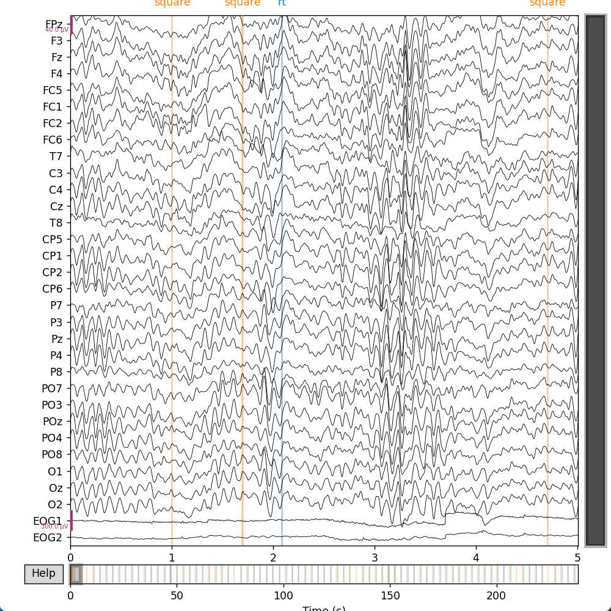


### 一些思考和尝试：What problem I want to try?

当然，下面缩写，不过是一些想法，尚未付诸实践。

1.VAE对脑机信号序列进行预测，并利用预测结果进行脑机接口的训练和应用。


2.高并发的数据，高通量以为在同一时间可能有多个传感器设备在运行读取输出数据，从硬件层面上讲，硬件将面临巨大的压力，从数据处理的角度而言，从数据的清洗，到数据的处理，都是一个巨大的压力。

那么是否可以利用CNN进行学习预测之后进行简化或者生成测试数据呢？


## 参考文献：
【主要为blog和一些与ChatGPT的对话记录】

[BciPy初步了解](./references/BciPy初步了解.html)

[EDF数据格式构成](./references/EDF数据格式构成.html)

[LSL流本质是读取EEG数据并保存为edf](./references/LSL流本质是读取EEG数据并保存为edf.html)

[脑电EEG代码开源链接](./references/脑电EEG代码开源链接.html)
